# ColoRUSH – Your Dream Colorado Adventure

ColoRUSH is a full-stack web application that generates a personalized summer adventure route across Colorado based on your favorite extreme sports. Users can choose activities like mountain biking, hiking, rafting, and more, and the app optimizes a scenic and efficient travel path using embedded Google Maps.

---

## Live Demo

[Deployed Frontend URL](https://your-live-frontend-link.com)

[Deployed Backend API](https://your-api-url.com)

---

## Screenshots

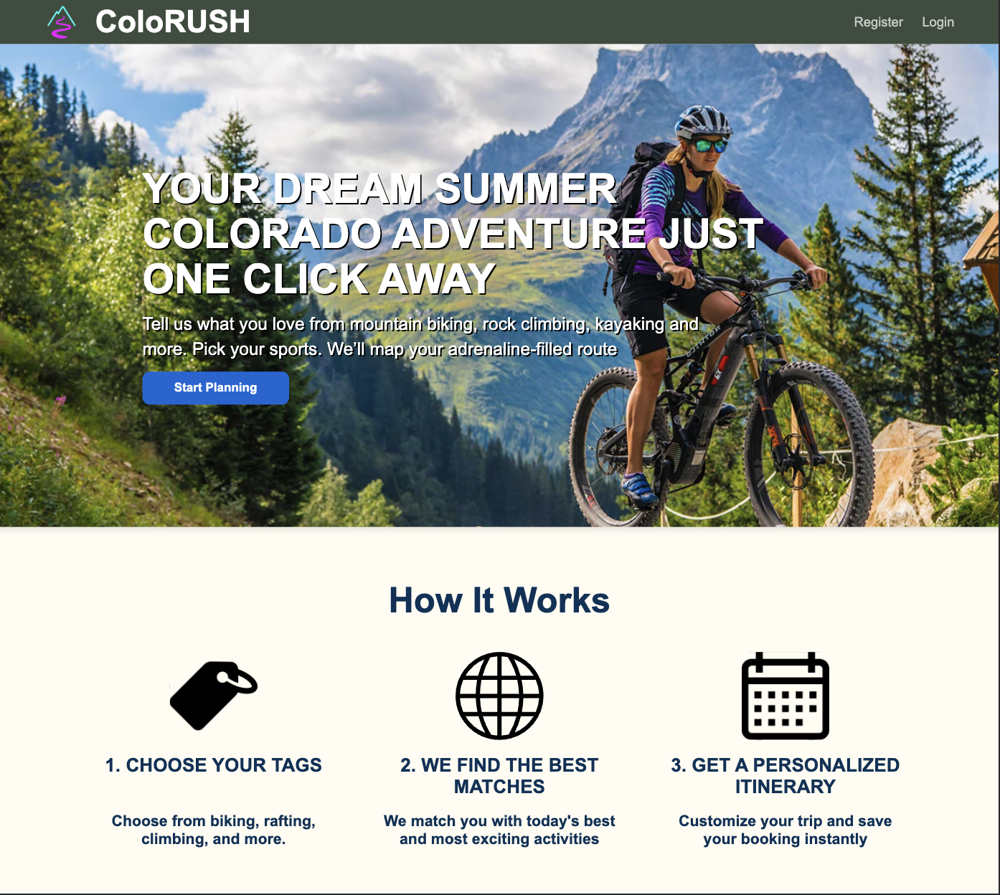
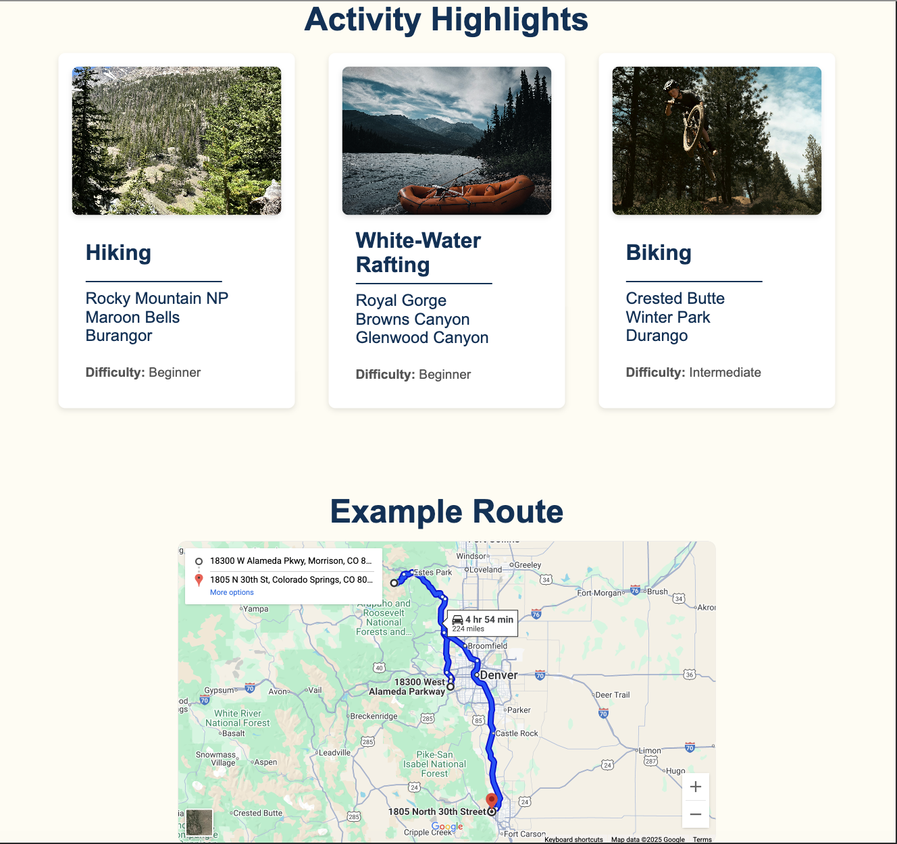
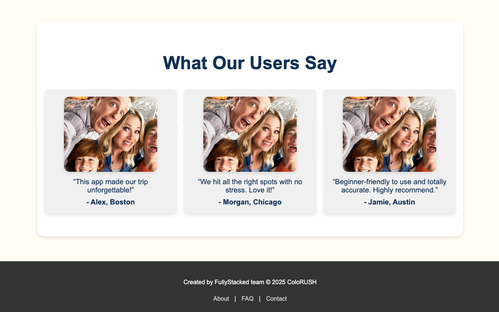
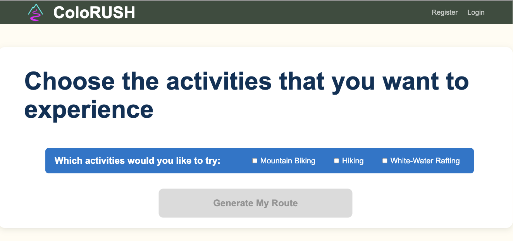

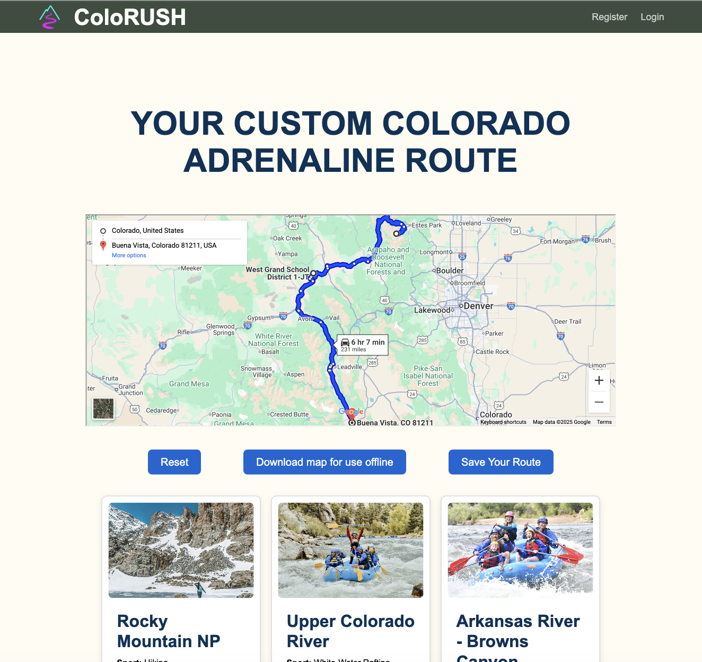
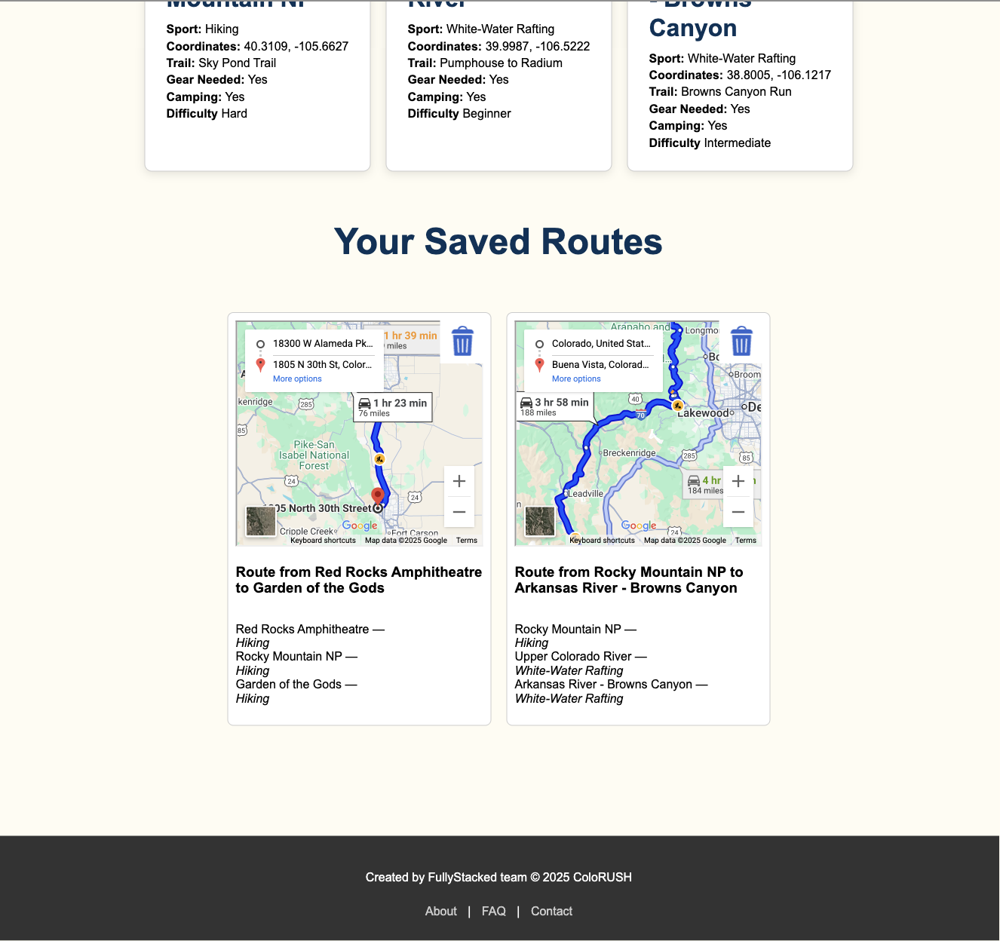
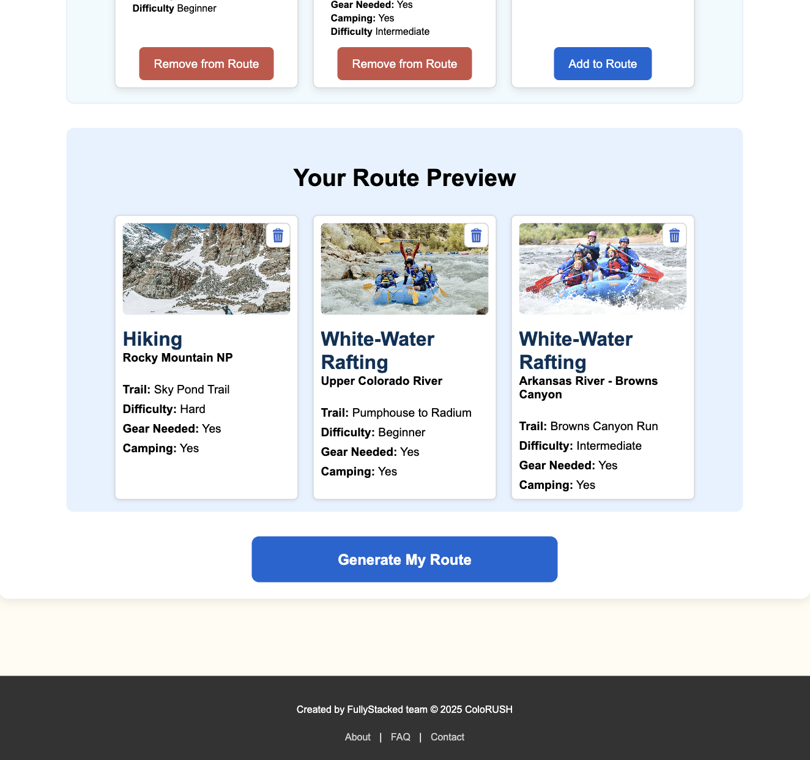
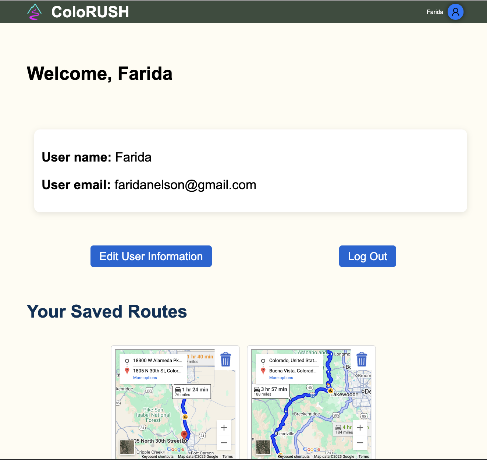
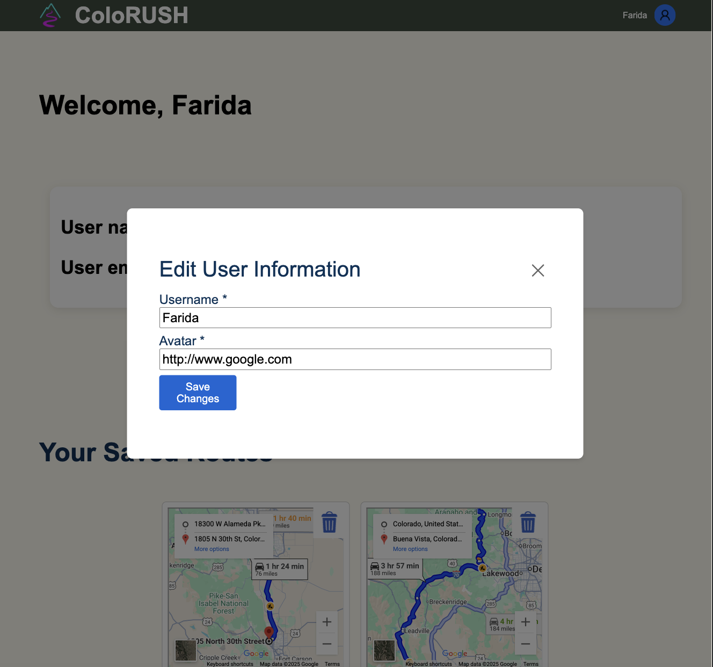
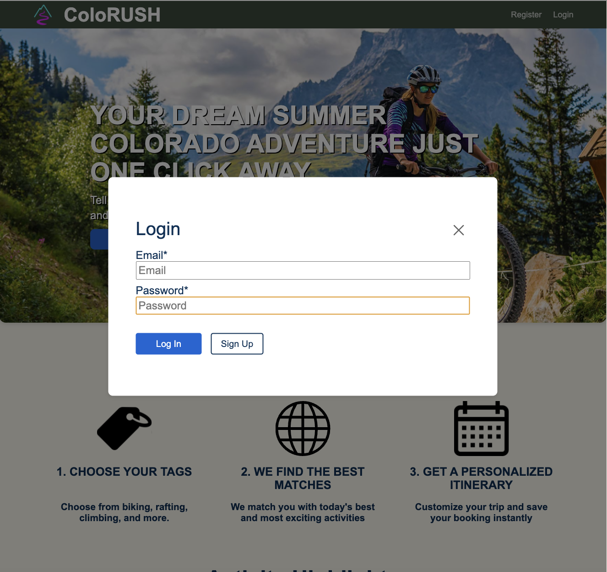
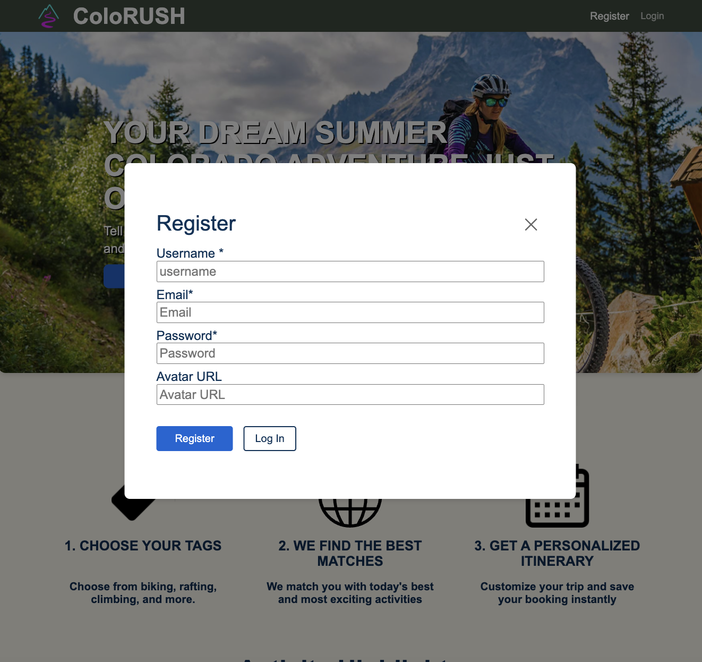


---

## Features

- Select extreme sports and difficulty levels
- See your custom route embedded in Google Maps
- Save and revisit your favorite routes with previews
- Reusable UI components (e.g., `SavedRoutes`)
- Responsive and animated interface with React + Vite

---

## Tech Stack

### Frontend

- [React](https://reactjs.org/)
- [Vite](https://vitejs.dev/)
- [Google Maps Embed API](https://developers.google.com/maps/documentation/embed)

### Backend

- [Node.js](https://nodejs.org/)
- [Express](https://expressjs.com/)
- [MongoDB](https://www.mongodb.com/)
- [Mongoose](https://mongoosejs.com/)

---

## Project Structure

```
/client
  └── public
  └── src
      ├── components
          ├── pages
          ├── App
          ├── DeveloperCard
          ├── Footer
          ├── Header
          ├── Hero
          ├── HighlightCard
          ├── Highlights
          ├── HowItWorks
          ├── modals
          ├── ProtectedRoute
          ├── RoutePreview
          ├── SavedRoutes
          └── Testimonials
      ├── assets
      ├── constants
      ├── contexts
      ├── utils
      ├── index.css
      └── main.jsx

/server
  ├── controllers
  ├── middlewares
  ├── mockData
  ├── routes
  ├── models
  ├── scripts
  ├── utils
  └── app.js
```

---

## Getting Started

### 1. Clone the repository

```bash
git clone https://github.com/your-username/ColoRUSH.git
cd ColoRUSH
```

### 2. Set up environment variables

Create `.env` files in both `/client` and `/server`:

#### `client/.env`

```env
VITE_GOOGLE_MAPS_API_KEY=your-google-maps-api-key
```

#### `server/.env`

```env
PORT=3001
MONGO_URI=mongodb://localhost:27017/colorush
JWT_SECRET=your_jwt_secret
```

---

### 3. Install Dependencies

```bash
# Frontend
cd client
npm install

# Backend
cd ../server
npm install
```

---

### 4. Run the App Locally

```bash
# In separate terminals
cd client && npm run dev
cd server && npm run start
```

---

## Team FULLY STACKED Members

- **Ryan Bommarito**
- **Farida Nelson**
- **Matthews Jordao**
- **Sohini Tomar**
- **Rawaa Yousseif**

---

## Future Improvements

- Add user login with route syncing to backend
- Export routes to Google Maps or PDF
- Add more sports: Rock climbing,, Camping & horseback riding, Boating & kayaking, Jet-skiing & swimming, Sky diving, Summer skiing & snowboarding
- Add ratings or tags for adventure quality

---

## License

MIT License
